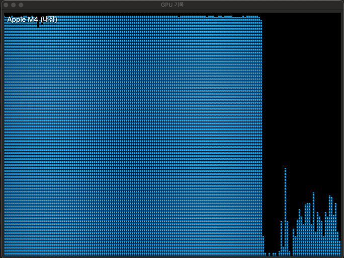

# llm_application_study

```
 pip install datasets llama-index==0.10.34 langchain-openai==0.1.6 "nemoguardrails[openai]==0.8.0" openai==1.25.1 chromadb==0.5.0 wandb==0.16.6 llama-index-callbacks-wandb==0.1.2
 pip install sentence-transformers==2.7.0 datasets==2.19.0 huggingface_hub==0.23.0 faiss-cpu==1.8.0
 pip install "httpx<0.27.0"
```


